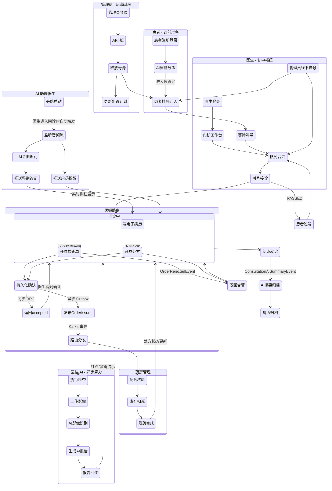
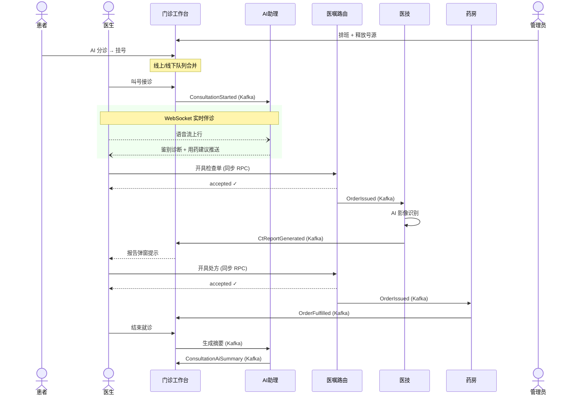

# 智慧云脑诊疗平台 - 核心流程活动图



---

## 泳道版（简化视角）



---

## 状态速览

```
Consultation:  WAITING ──▶ IN_PROGRESS ──▶ FINISHED
                          └──▶ PASSED

MedicalOrder:  PENDING ──▶ ACCEPTED ──▶ ROUTED ──▶ COMPLETED
                              └──────────────────▶ REJECTED

ImagingTask:   RECEIVED ──▶ PREPROCESSING ──▶ INFERRING ──▶ COMPLETED
                                                    └──▶ FAILED
```
