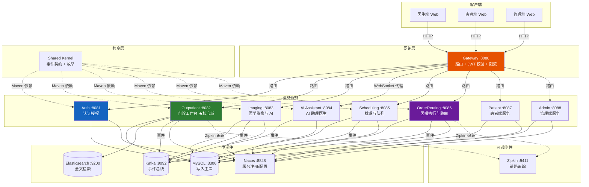
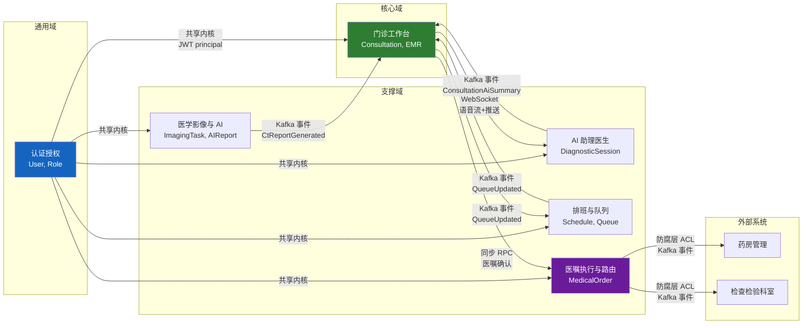
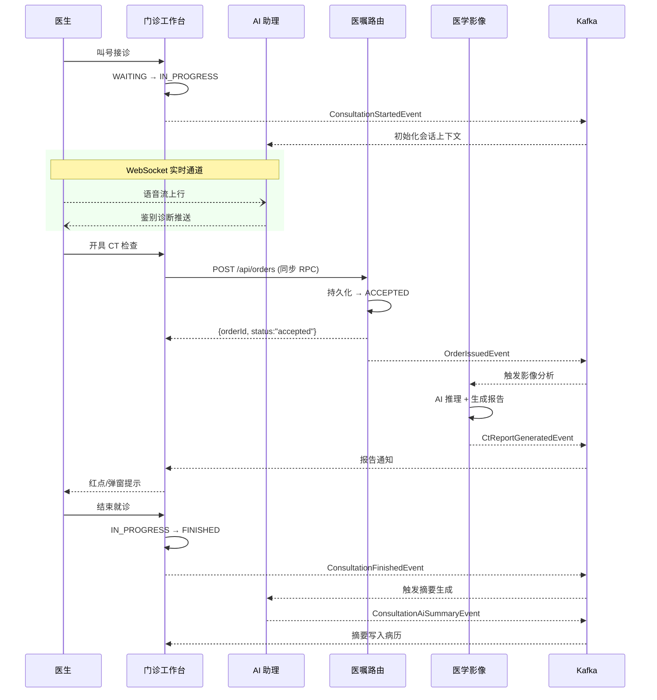
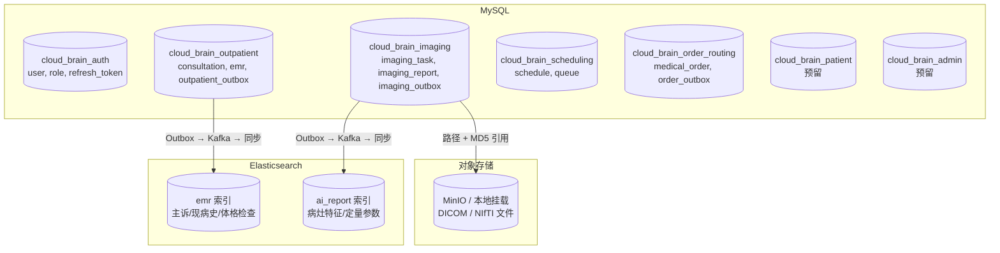

# 智慧云脑诊疗平台 - 系统结构图

## 1. 全系统拓扑

---

## 2. DDD 限界上下文映射

---

## 3. 通信矩阵

| 源 → 目标 | 方式 | 通道 | 场景 |
|---|---|---|---|
| 客户端 → Gateway | HTTP | — | 所有前端请求入口 |
| Gateway → 各服务 | HTTP 路由 | Nacos 寻址 | 请求转发 |
| Gateway → AI Assistant | WebSocket 代理 | Nacos | 语音流直通 |
| Outpatient → OrderRouting | **同步 RPC** | OpenFeign | 医嘱确认（3s 超时） |
| Outpatient → Kafka | Outbox 异步 | `outpatient-consultation-events` | 接诊开始/结束 |
| OrderRouting → Kafka | Outbox 异步 | `medical-order-events` | 医嘱路由/完成/驳回 |
| Imaging → Kafka | Outbox 异步 | `medical-imaging-events` | AI 报告生成 |
| AI Assistant → Kafka | 异步 | `ai-assistant-events` | 会话摘要归档 |
| Scheduling → Kafka | Outbox 异步 | `doctor-scheduling-events` | 队列变更 |
| 门诊前端 ↔ AI Assistant | **WebSocket** | STOMP | 实时语音流 + 建议推送 |
| Outpatient → ES | Outbox 同步 | Kafka `emr-data-change-events` | EMR 全文索引 |
| 各服务 → Nacos | HTTP 心跳 | — | 服务注册/发现 |
| 各服务 → Zipkin | HTTP 上报 | OpenTelemetry | 链路追踪 |

---

## 4. 核心事件流（一次完整就诊）

---

## 5. 数据存储分布

---

## 6. 项目模块一览

| 模块 | 端口 | 领域类型 | 代码状态 | 核心聚合根 |
|---|---|---|---|---|
| **shared-kernel** | — | 类库 | ✅ 完成 | 3 枚举 + 10 事件 |
| **gateway** | 8080 | 网关 | ✅ 完成 | 9 路由 + JWT 校验 |
| **auth** | 8081 | 通用域 | ✅ 完成 | User, Role |
| **outpatient** | 8082 | ★核心域 | ✅ 完成 | Consultation, EMR |
| **imaging** | 8083 | 支撑域 | ❌ 空壳 | ImagingTask, AIReport |
| **ai-assistant** | 8084 | 支撑域 | ❌ 空壳 | DiagnosticSession |
| **scheduling** | 8085 | 支撑域 | ❌ 空壳 | Schedule, Queue |
| **order-routing** | 8086 | 支撑域 | ✅ 完成 | MedicalOrder |
| **patient** | 8087 | 通用域 | 🔒 骨架 | 预留 |
| **admin** | 8088 | 通用域 | 🔒 骨架 | 预留 |
